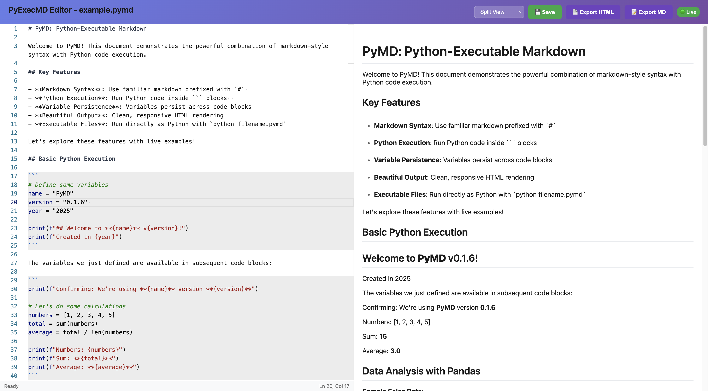

# PyMD: Python-Powered Markdown

[](https://pepy.tech/projects/pyexecmd)

PyMD is a revolutionary markup language that creates **executable Python files** that also render beautifully as markdown documents. All markdown content is prefixed with `#` (making it Python comments), while code blocks contain regular executable Python code that prints markdown during rendering.



## ✨ Features

- **🐍 Executable Python Files**: Files can be run directly with `python filename.pymd`
- **📝 Commented Markdown**: All markdown content is prefixed with `#` (Python comments)
- **🖨️ Print-to-Markdown**: Python `print()` statements output markdown content during rendering
- **🎨 Dual Code Block Types**:
  - **``` (3 backticks)**: Execute Python code and process print output as markdown
  - **```` (4 backticks)**: Display code with syntax highlighting only
- **🔗 Variable Persistence**: Variables persist across code blocks in the same document
- **🔴 Live Preview**: Real-time rendering with auto-refresh as you edit
- **📊 Rich Visualizations**: Built-in support for matplotlib, pandas, and other data science libraries
- **🖼️ Automatic Image Capture**: `plt.show()` automatically saves and renders plots in HTML and Markdown
- **🎬 Video Support**: Built-in video rendering with customizable controls, autoplay, and loop options
- **📋 Table Support**: Automatic detection and rendering of markdown tables with proper formatting
- **🧮 Dynamic Content**: Execute Python code and display results inline
- **📱 Beautiful Output**: Clean, responsive HTML with modern styling
- **⚡ Fast Rendering**: Efficient parsing and rendering engine with caching
- **🔄 Auto-Refresh**: Changes reflect immediately in the live preview
- **💬 Smart Comments**: Display blocks use `//` for cleaner code presentation
- **📄 Export Options**: Export to HTML or standard Markdown formats with embedded images
- **🖼️ Image Management**: Automatic file organization with unique naming and format flexibility
- **🖱️ One-Click Export**: Export buttons in the web editor interface
- **↔️ Backward Compatible**: Supports both executable and legacy syntax

## 🚀 Quick Start

### Installation

**Option 1: Install from PyPI (Recommended)**

```bash
pip install pyexecmd
```

<details>

<summary> Option 2: Install from source </summary>

1. **Clone the repository:**

   ```bash
   git clone https://www.github.com/treeleaves30760/PyMD
   cd PyMD
   ```

2. **Install in development mode:**

   ```bash
   pip install -e .
   ```

</details>

## Usage

### For PyPI Installation

1. **Create a new PyMD document:**

   ```bash
   pyexecmd create my_document.pymd
   ```

2. **Start live preview with web editor:**

   ```bash
   pyexecmd serve --file my_document.pymd --port 8080
   ```

   Then open <http://localhost:8080/editor> in your browser for the full editor experience, or <http://localhost:8080> for display-only view.

   > **Note for macOS users:** Port 5000 is often used by AirPlay. Use `--port 8000` or another port to avoid conflicts.

3. **Export Options:**

   ```bash
   # Render to HTML
   pyexecmd render my_document.pymd -o output.html
   
   # Render to Markdown
   pyexecmd render my_document.pymd -f markdown -o output.md
   ```

<details>
<summary> For Conda Users (Recommended Development Setup) </summary>

If you're using conda for development, first activate the environment:

```bash
# Initialize conda and activate environment
source /opt/miniconda3/etc/profile.d/conda.sh && conda activate PyMD

# Verify activation
python --version && which python
```

Then use standard Python commands:

```bash
# Create a new PyMD document
python -m pymd.cli create my_document.pymd

# Start live preview with web editor
python -m pymd.cli serve --file my_document.pymd --port 8080

# Render to HTML
python -m pymd.cli render my_document.pymd -o output.html

# Render to Markdown
python -m pymd.cli render my_document.pymd -f markdown -o output.md
```

</details>

### Web Editor Features

The web editor (available at `/editor`) includes:

- **📝 Split-view editing**: Side-by-side editor and live preview
- **🖱️ One-click export**: Export HTML and Markdown buttons in the interface
- **⚡ Live rendering**: Ctrl+S to execute code and update preview
- **💾 File management**: Save and download your documents
- **🎨 Syntax highlighting**: Python syntax highlighting with PyMD-specific features

## 📝 PyMD Syntax

PyMD files are **executable Python scripts** where:

- **Markdown content** is prefixed with `#` (Python comments)
- **Code blocks** contain regular Python code that prints markdown
- **Print output** becomes rendered markdown content during PyMD rendering
- **Files run as Python** and render as beautiful documents

### Basic Structure

```python
# # This is a markdown header
# 
# This is regular markdown text with **bold** formatting.
#
# - This is a list item
# - Another list item
#
# ```
# This is a comment in the code block
print("## This becomes a rendered H2 header")
print("Regular text from Python print statement")
print("- **Dynamic list item** with variables")
# ```
#
# More markdown content here...
```

### 📝 Markdown Content (Prefixed with `#`)

All markdown content is prefixed with `#` making it Python comments:

**Headers:**

```python
# # Main Title
# ## Section Title  
# ### Subsection Title
```

**Lists:**

```python
# - Unordered list item
# - Another unordered item
#
# 1. Ordered list item
# 2. Another ordered item
```

**Plain Text:**

```python
# This is a paragraph of regular text.
# You can write multiple paragraphs easily.
```

**Comments:**

```python
# // This is a comment and will be ignored during rendering
```

### 🐍 Code Blocks (Executable Python)

Code blocks markers are prefixed with `#`, but the code inside is regular Python:

**Executable Code Block:**

```python
# ```
# This is a comment inside the code block
x = 42
y = "Hello, PyMD!"
print(f"## {y} The answer is {x}")  # This becomes an H2 header
print(f"The calculation result: **{x * 2}**")  # Bold text
# ```
```

**Display-Only Code Block:**

```python
# ````
# def example_function():
#     // This code is displayed but not executed
#     return "example"
# ````
```

### 📋 Table Support

PyMD automatically detects and renders markdown tables with proper formatting:

```python
# # Employee Report
#
# Here's our team data:
#
# | Name | Age | Department | Score |
# | --- | --- | --- | --- |
# | Alice | 28 | Engineering | 95 |
# | Bob | 32 | Sales | 87 |
# | Charlie | 29 | Marketing | 92 |
#
# You can also generate tables dynamically from code:
#
# ```
import pandas as pd

# Create sample data
employees = pd.DataFrame({
    'Name': ['Diana', 'Eve', 'Frank'], 
    'Age': [26, 31, 35],
    'Department': ['Design', 'HR', 'Finance'],
    'Score': [89, 94, 88]
})

print("## Dynamic Employee Data")
print()
for _, row in employees.iterrows():
    print(f"| {row['Name']} | {row['Age']} | {row['Department']} | {row['Score']} |")
# ```
```

### 🖼️ Automatic Image Rendering

PyMD automatically captures and renders matplotlib plots when you use `plt.show()`:

```python
# # Data Visualization Report
#
# Let's create some visualizations:
#
# ```
import matplotlib.pyplot as plt
import numpy as np

# Create sample data
x = np.linspace(0, 10, 100)
y = np.sin(x)

# Create plot
plt.figure(figsize=(10, 6))
plt.plot(x, y, 'b-', linewidth=2, label='sin(x)')
plt.title('Sine Wave Visualization')
plt.xlabel('X values')
plt.ylabel('Y values')
plt.legend()
plt.grid(True, alpha=0.3)

# This automatically captures and renders the plot!
plt.show()
# ```
#
# ```
# Create another plot
y2 = np.cos(x)
plt.figure(figsize=(10, 6))
plt.plot(x, y2, 'r-', linewidth=2, label='cos(x)')
plt.title('Cosine Wave Visualization')
plt.xlabel('X values')
plt.ylabel('Y values')
plt.legend()
plt.grid(True, alpha=0.3)

# Multiple plots are automatically captured
plt.show()
# ```
#
# Each `plt.show()` call automatically:
# - **Saves the plot** as a PNG file in an `images/` directory
# - **Renders in HTML** with file references and base64 fallbacks
# - **Embeds in Markdown** using standard `` syntax
# - **Generates unique filenames** to avoid conflicts
```

### 📊 Complete Example

**Data Analysis with Print-to-Markdown:**

```python
# # Data Analysis Report
#
# Let's analyze some sample data:
#
# ```
import pandas as pd
import numpy as np

# Create sample data
np.random.seed(42)
data = pd.DataFrame({
    'Name': ['Alice', 'Bob', 'Charlie'],
    'Score': [95, 87, 92],
    'Department': ['Engineering', 'Sales', 'Marketing']
})

print("## Sample Employee Data")
print(f"**Total employees:** {len(data)}")
print(f"**Average score:** {data['Score'].mean():.1f}")
print()
print("### Individual Scores:")
for _, row in data.iterrows():
    print(f"- **{row['Name']}** ({row['Department']}): {row['Score']}")
# ```
#
# ## Analysis Results
#
# The data shows interesting patterns in employee performance.
```

### 💬 Interactive Input with Mock Values

```python
# ## User Profile Generator
#
# ```
# Get user input (with mock values for non-interactive execution)
name = input("Enter your name: ") # input: Alice
age = input("Enter your age: ") # input: 25

print(f"### Welcome, {name}!")
print(f"**Age:** {age} years old")
print(f"**Birth year:** {2025 - int(age)}")

# Input without mock value defaults to empty string
optional_input = input("Optional comment: ")
if optional_input:
    print(f"**Comment:** {optional_input}")
else:
    print("*No comment provided*")
# ```
```

### 🎨 Display-Only Code Blocks

Use four backticks for code that displays but doesn't execute:

```python
# ## Algorithm Reference
#
# Here's the algorithm we'll implement:
#
# ````
# def factorial(n):
#     // Base case
#     if n <= 1:
#         return 1
#     // Recursive case  
#     return n * factorial(n-1)
# 
# // Example usage (this won't execute)
# result = factorial(5)
# ````
#
# Now let's implement it:
#
# ```
def factorial(n):
    if n <= 1:
        return 1
    return n * factorial(n-1)

result = factorial(5)
print(f"## Factorial Results")
print(f"Factorial of 5 is: **{result}**")
# ```
```

### 🔑 Key Concepts

- **🐍 Executable Python**: Files run directly with `python filename.pymd`
- **📝 Commented Markdown**: All markdown content prefixed with `#` (Python comments)
- **🖨️ Print-to-Markdown**: Use `print()` to output markdown that gets rendered
- **🔗 Variable Persistence**: Variables persist across all code in the file
- **📦 Two Code Block Types**:
  - **``` (3 backticks)**: Execute Python and process print output as markdown
  - **```` (4 backticks)**: Display code with syntax highlighting (no execution)
- **💬 Interactive Input**: Use `input()` with mock values for non-interactive execution
- **🎨 Clean Rendering**: `#` prefixes hidden during HTML/Markdown export
- **📊 Rich Output**: Print statements can output headers, lists, tables, even HTML
- **🖼️ Automatic Plot Capture**: `plt.show()` calls automatically save and render images
- **🎬 Video Rendering**: Use `pymd.video()` to embed videos with customizable options
- **📋 Smart Table Rendering**: Markdown tables are automatically detected and styled
- **💡 Smart Comments**: Use `//` in display blocks for cleaner presentation
- **↔️ Dual Purpose**: Same file serves as Python script AND beautiful document

## 🛠️ Syntax Reference

### 📝 Markdown Content (All prefixed with `#`)

**Headers:**

```python
# # Level 1 Header
# ## Level 2 Header  
# ### Level 3 Header
```

**Lists:**

```python
# - Unordered list item
# - Another item
# 
# 1. Ordered list item
# 2. Another ordered item
```

**Text and Formatting:**

```python
# Regular paragraph text.
# 
# Text with **bold** and *italic* formatting.
# 
# // This is a comment (ignored during rendering)
```

**Tables:**

```python
# | Header 1 | Header 2 | Header 3 |
# | --- | --- | --- |
# | Cell 1 | Cell 2 | Cell 3 |
# | Row 2 | Data | More Data |
#
# Tables support alignment:
# | Left | Center | Right |
# | :--- | :---: | ---: |
# | Left aligned | Centered | Right aligned |
```

### 🐍 Code Blocks (Regular Python)

**Executable Code Block:**

```python
# ```
# Comments inside code blocks (optional)
variable = "Hello World"
print(f"## {variable}")  # Becomes H2 header in output
print(f"Current value: **{variable}**")  # Bold text in output
print("- First result")   # List item in output
print("- Second result")  # Another list item
# ```
```

**Display-Only Code Block:**

```python
# ````
# def example_function():
#     // This is displayed but not executed
#     // Use // for comments in display blocks
#     return "example"
# ````
```

### 🖨️ Print-to-Markdown

Use `print()` statements to output markdown content:

```python
# ```
data = [1, 2, 3, 4, 5]
print("## Analysis Results")  # H2 header
print(f"**Count:** {len(data)}")  # Bold text
print(f"**Sum:** {sum(data)}")    # Bold text
print("### Detailed Breakdown:")   # H3 header
for i, value in enumerate(data, 1):
    print(f"{i}. Item value: **{value}**")  # Ordered list
# ```
```

### 🖼️ Automatic Plot Rendering

Matplotlib plots are automatically captured when using `plt.show()`:

```python
# ```
import matplotlib.pyplot as plt
import numpy as np

# Create visualization
x = np.linspace(0, 10, 100)
y = np.sin(x)
plt.figure(figsize=(8, 6))
plt.plot(x, y, 'b-', linewidth=2)
plt.title('Automatic Plot Capture')
plt.grid(True)

# Automatically saves image and includes in output
plt.show()
# ```
```

**Image Features:**

- **Automatic saving**: Images saved to `images/` directory
- **Unique filenames**: `plot_1_abc123.png` format prevents conflicts  
- **HTML fallback**: Base64 encoding for portability
- **Markdown compatible**: Standard `` syntax

### 🎬 Video Rendering

PyMD now supports video embedding with the `pymd.video()` function:

```python
# # Video Demonstration
#
# Let's embed a video in our document:
#
# ```
# Basic video with caption
pymd.video("demo.mp4", "This is a demo video")

# Customized video with options
pymd.video("tutorial.mp4", "Tutorial video", 
          width="80%", 
          autoplay=True, 
          loop=True, 
          controls=True)

# Background video (no controls)
pymd.video("background.mp4", 
          width="100%", 
          height="400px",
          controls=False, 
          autoplay=True, 
          loop=True)
# ```
```

**Video Features:**

- **Automatic file management**: Videos copied to `videos/` directory
- **Multiple format support**: MP4, WebM, OGG with automatic source tags
- **Customizable attributes**: width, height, controls, autoplay, loop
- **Caption support**: Optional video descriptions
- **HTML5 compatible**: Modern video tags with fallback sources
- **Markdown export**: HTML video tags preserved in markdown output

**Supported Parameters:**

| Parameter | Type | Default | Description |
|-----------|------|---------|-------------|
| `video_path` | str | required | Path to the video file |
| `caption` | str | `''` | Optional caption for the video |  
| `width` | str | `'100%'` | Video width (CSS format) |
| `height` | str | `'auto'` | Video height (CSS format) |
| `controls` | bool | `True` | Show video controls |
| `autoplay` | bool | `False` | Auto-play video on load |
| `loop` | bool | `False` | Loop video playback |

### 💡 Best Practices

- **File Structure**: Start with `# # Title` as the main header
- **Code Comments**: Use `# Comments` inside code blocks for Python comments
- **Markdown Output**: Use `print()` to generate headers, lists, and formatted text
- **Display Code**: Use `# ````...# ``````` for code examples that shouldn't execute
- **Variables**: Define variables in code blocks and reference them in print statements
- **Clean Syntax**: Keep markdown content in `#` prefixed sections, code in blocks
- **Tables**: Use standard markdown table syntax with `|` separators for static tables
- **Images**: Use `plt.show()` for automatic plot capture, or `pymd.image()` for manual control
- **Videos**: Use `pymd.video()` to embed videos with appropriate controls and sizing
- **File Organization**: Images saved to `images/` directory, videos to `videos/` directory
- **Performance**: Large plots are automatically optimized for web display

### CLI Commands

```bash
# Create new PyExecMD file from template
pyexecmd create <filename> [--force]

# Start live preview server with web editor
pyexecmd serve [--file FILE] [--port PORT] [--host HOST] [--debug] [--mode {editing,viewing,both}]

# Render PyExecMD to HTML (default)
pyexecmd render <input> [-o OUTPUT] [-f html]

# Render PyExecMD to Markdown
pyexecmd render <input> [-o OUTPUT] -f markdown

# Render options
pyexecmd render <input> --format {html,markdown} --output <filename>
```

#### Command Examples

```bash
# Conda development setup
source /opt/miniconda3/etc/profile.d/conda.sh && conda activate PyMD

# Create and serve
python -m pymd.cli create tutorial.pymd
python -m pymd.cli serve --file tutorial.pymd --port 8080

# Export to different formats
python -m pymd.cli render tutorial.pymd -o tutorial.html          # HTML export
python -m pymd.cli render tutorial.pymd -f markdown -o tutorial.md # Markdown export
python -m pymd.cli render tutorial.pymd -f markdown               # Print to stdout

# PyPI installation
pyexecmd create tutorial.pymd
pyexecmd serve --file tutorial.pymd --port 8080
pyexecmd render tutorial.pymd -f markdown -o tutorial.md
```

## 🌟 Examples

### Simple Example (`example-simple.pymd`)

```python
# # Simple PyMD Example
#
# This demonstrates basic syntax:
#
# ```
# This is a comment in Python
print("## Hello from PyMD!")
a = 20
b = 30
print(f"The answer is: **{a + b}**")
# ```
#
# - This is a markdown list item
# 1. This is an ordered list item
```

**Usage:**

- **Run as Python**: `python example-simple.pymd`
- **Render to HTML**: `python -m pymd.cli render example-simple.pymd -o output.html`

### Comprehensive Example (`example.pymd`)

Check out `example.pymd` for a full demonstration including:

- **Executable Python file** with `#` prefixed markdown content
- **Data analysis** with pandas and numpy
- **Print-to-markdown** for dynamic content generation
- **Variable persistence** across code blocks
- **Interactive input** with mock values
- **Mixed workflow** of documentation and executable code
- **Export functionality** (HTML and Markdown)

### Complex Example (`example-complex.pymd`)

Advanced features including:

- **Machine learning model loading**
- **Error handling and device management**
- **AI text generation integration**
- **Complex data processing workflows**

### 🚀 Quick Example Usage

**1. Run as executable Python:**

```bash
python example.pymd
```

**2. Render as beautiful HTML:**

```bash
python -m pymd.cli render example.pymd -o presentation.html
```

**3. Export to standard Markdown:**

```bash
python -m pymd.cli render example.pymd -f markdown -o documentation.md
```

**4. Live editor with preview:**

```bash
python -m pymd.cli serve --file example.pymd --port 8080
# Open http://localhost:8080/editor in your browser
```

**How Export Works:**

- **HTML Export**: Full rendering with executed code output and styled markdown
- **Markdown Export**: Removes `#` prefixes and converts to standard markdown
- **Source Files**: Remain executable Python scripts with commented markdown
- **Compatibility**: Exported markdown works with GitHub, GitLab, and other renderers

**Output Directory Structure:**

After rendering documents with images and videos, your output directory will look like:

```bash
my_project/
├── document.pymd           # Source PyMD file
├── document.html           # Rendered HTML output
├── images/                 # Auto-generated plot images
│   ├── plot_1_abc123.png
│   └── plot_2_def456.png
└── videos/                 # Embedded video files
    ├── video_1_ghi789.mp4
    └── video_2_jkl012.mp4
```

**Web Editor Features:**

1. **Live Editing**: Open `http://localhost:8080/editor` in your browser
2. **Syntax Highlighting**: `#` prefixed markdown and Python code blocks
3. **Live Preview**: See rendered output in real-time
4. **Export Options**: Click **📄 Export HTML** or **📝 Export MD**
5. **File Execution**: Use Ctrl+S to execute code and update preview

## 🎯 Use Cases

- **📊 Data Science Reports**: Python scripts that execute analysis AND generate beautiful reports with automatic plot capture
- **📚 Executable Documentation**: Documentation that actually runs and validates itself, with embedded visualizations and demo videos
- **🎓 Interactive Tutorials**: Learning materials that students can execute and modify, featuring live charts, tables, and instructional videos
- **📈 Living Dashboards**: Python scripts that generate dynamic visual reports with automatic image saving
- **🔬 Reproducible Research**: Research papers where the code actually runs and produces publication-ready figures
- **🧪 Literate Programming**: Self-documenting code through executable markdown comments with inline visualizations
- **📋 Technical Specifications**: Specs that include working code examples and automatically generated plots
- **🤖 AI/ML Workflows**: Machine learning pipelines with embedded documentation and automatic model visualization
- **📑 Business Reports**: Automated reports with data tables and charts that update when code runs
- **🎨 Presentation Materials**: Technical presentations that combine code, explanation, live visualizations, and demo videos

## 📁 Project Structure

```file
PyMD/
├── pymd/                   # Main package directory
│   ├── __init__.py        # Package initialization
│   ├── cli.py             # Command-line interface
│   ├── renderer.py        # Core rendering engine
│   └── server.py          # Live preview server
├── example.pymd           # Example PyMD document
├── pyproject.toml         # Package configuration
├── MANIFEST.in            # Additional files to include
├── LICENSE                # MIT License
├── requirements.txt       # Python dependencies
└── README.md              # This file
```

## 🤝 Contributing

We welcome contributions! Please feel free to submit issues, feature requests, or pull requests.

## 📄 License

This project is licensed under the MIT License.

---
